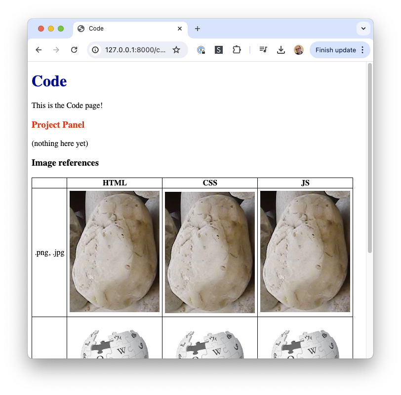

# hello-django-vite

This Django project is a prototype that shows how to integrate Django with Vite, using the [django-vite] library.

[django-vite]: https://pypi.org/project/django-vite/

It is structured at the filesystem level in a similar way as TechSmart's Platform codebase at [tsk-website], to hopefully make it easier to integrate elements of the prototype directly into the Platform.

[tsk-website]: https://github.com/techsmartkids/tsk-website

## How to Run

Install the prerequisites:

* [Python 3.10+](https://www.python.org/downloads/)
* Poetry
    * `python3 -m pip install pipx`
    * `python3 -m pipx install "poetry>=1.7,<1.8"`

In terminal window 1, install dependencies and apply patches:

```
$ poetry shell
$$ poetry install --no-root
$$ python3 apps/tools/vite/apply_django_vite_patches.py
```

In terminal window 1, run the Django development server:

```
$$ python3 manage.py runserver
```

Alternatively you can run the production server:

```
$$ DJANGO_DEBUG=False python3 manage.py runserver
```

In terminal window 2, open your browser to the running site:

```
$ open http://127.0.0.1:8000/
```

You should see a webpage that looks something like this:




## How it works

* In **development mode** (when `DJANGO_DEBUG` is unset or `True`):
    * The `runserver` management command will:
        * 1. start a Vite development server running on port :3000, and
        * 2. start the Django development server on port :8000.
    * When a request is made for a page on Django's :8000 port (such as <http://127.0.0.1:8000/code/>), Django renders the appropriate HTML template itself (ex: `code/code.html`).
        * The HTML template includes the **root JS file** via a `<script src=...>` inserted by the `` tag.
        * The HTML template may NOT include **CSS files** directly, due to [current infrastructure limitations]. Any required CSS files will be injected by the root JS file to the DOM as an inline `<style>...</style>` tag once the JS loads.
            * The specific CSS code to inject is gathered from all JS→CSS imports that are reachable from the root JS file. These imports look like `import '@ts/code/code.css';`
        * The HTML template may refer to **raster image assets** (`.png` or `.jpg`) directly in HTML using code like ``.
    * The served HTML contains links to `.js` files and raster image files (`.png` or `.jpg`) that are served by the Vite development server on port :3000.
    * When the Vite development server receives a request to serve:
        * ...a `.js` file, it will build the associated JS bundle on-demand and serve it.
        * ...a raster image file (`.png` or `.jpg`), it will serve it as-is.
* In **production mode** (when `DJANGO_DEBUG=False`):
    * The `runserver` management command will:
        * 1. use Vite to build final `.js` and raster image assets (`.png` or `.jpg`) to `./local/`,
        * 2. use the [http-server] static file server to serve those final assets on port :3000,
        * 3. start the Django development server on port :8000.
    * When a request is made for a page on Django's :8000 port (such as <http://127.0.0.1:8000/code/>), Django renders the appropriate HTML template itself (ex: `code/code.html`).
    * The served HTML contains links to `.js` files and raster image files (`.png` or `.jpg`) that are served by the [http-server] static file server on port :3000.

[http-server]: https://www.npmjs.com/package/http-server
[current infrastructure limitations]: #known-limitations


## Ways to Reference Assets

* .py → .html
    * ✅ `return render(request, 'code/code.html', { ... })`
* .html → ...
    * .html → .js (root)
        * ✅ ``
    * .html → .css
        * ✖️ Not possible
    * .html → .jpg, .png, .svg
        * ✅ ``
            * A special patch to the `django_vite` library
              (by `apply_django_vite_patches.py`) was needed to support
              referencing these non-.js assets from .html when running the
              production server with DJANGO_DEBUG=False.
* .js → ...
    * .js → .js
        * ✅ `import { ... } from '@ts/code/panels/project.js';`
    * .js → .css
        * ✅ `import '@ts/code/panels/project.css';`
    * .js → .png, .jpg (for image URL)
        * ✅ `import boulderImageUrl from '@ts/code/imgs/boulderjoy.png';`
    * .js → .svg (for image URL)
        * ✅ `import skylarkImageUrl from '@ts/code/imgs/skylark-logomark-color.svg';`
* .css → ...
    * .css → .jpg, .png, .svg
        * ✅ `url('@ts/code/imgs/boulderjoy.png')`

<a name="known-limitations"></a>
## Known Limitations

> Key:
> * 👌 = A acceptable limitation
> * 🤔 = A limitation that would be nice to eliminate

* 👌 .html → .css imports
    * These imports are not possible.
    * Any such imports must be migrated from the .html file to an appropriate .js file that is itself imported (probably indirectly) from the .html page.
* 🤔 .js → .css imports
    * In development, each imported .css file is injected into the DOM of the page using an *inline* `<style>` tag, so **the filename and line numbers are not available** from the original .css file.
    * In production, the single concatenated .css file is injected into the DOM of the page using a `<link rel="stylesheet" src="..." />` reference. However that .css file does not have an associated sourcemap so **line numbers are not available**.
* 🤔 App-specific `static` directories cannot be used. Only a central `static` directory currently works.
    * This limitation is annoying because it forces .js files to live separately from .css and image files in the source code.